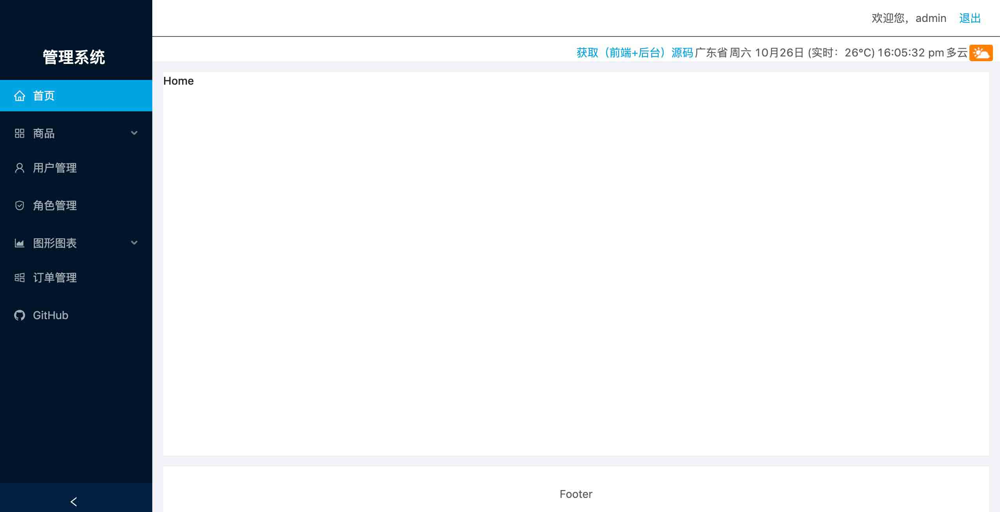

## 技术栈
>项目运行之前，请确保系统已经安装以下应用
1. node (6.0 及以上版本)
2. mongodb (开启状态)
3. 全局安装nodemon
## 运行启动
```
# 克隆到本地
1. git clone 

# 进入后台应用目录
2. cd react-manage/server

# 安装后台应用依赖
3. yarn install 

# 启动后台应用
4. yarn start  

# 进人前端应用目录
5. cd react-manage/client

# 安装前端应用依赖
6. yarn install

# 启动前端应用
7. yarn start

# 启动浏览器
8. 访问: http://localhost:3000
```
## 应用基本结构
### client/src
|文件目录 |含义 |
| ----- | ------  |
| api | ajax相关  |
| assets | 公用资源  |
| components | 公共组件（非路由组件）  |
| pages | 路由组件  |
| config | 配置文件  |
| utils  |工具模块  |
| App.js | 应用根模块  |
| index.js| 应用入口  |

## 预览

## 主页
