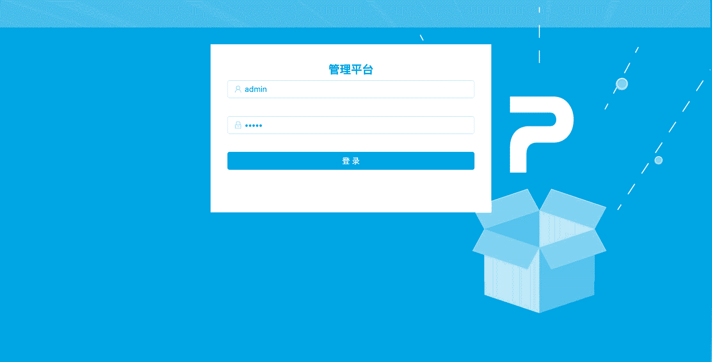
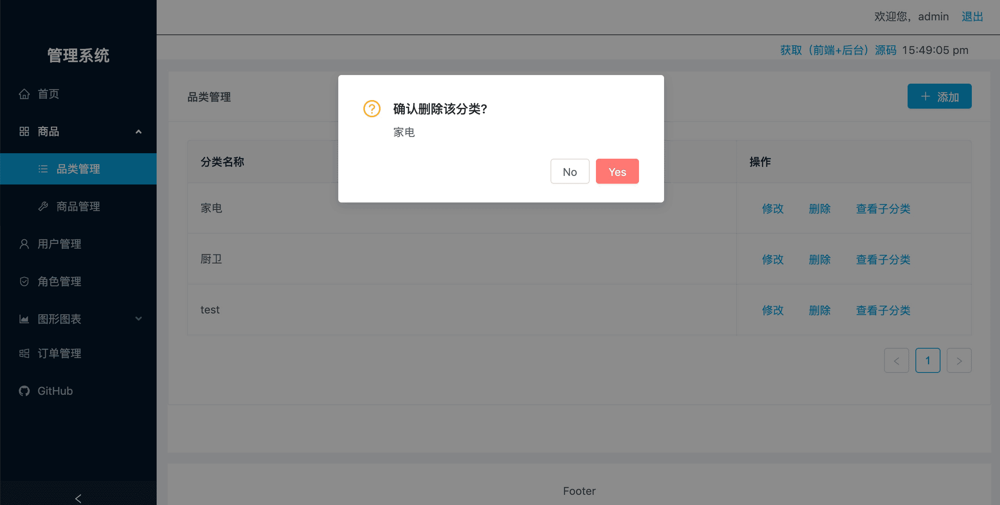
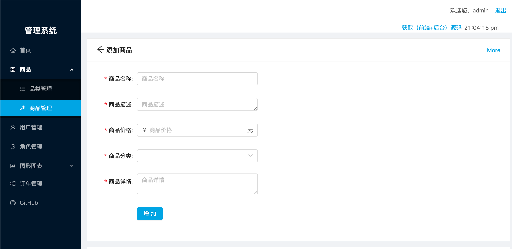
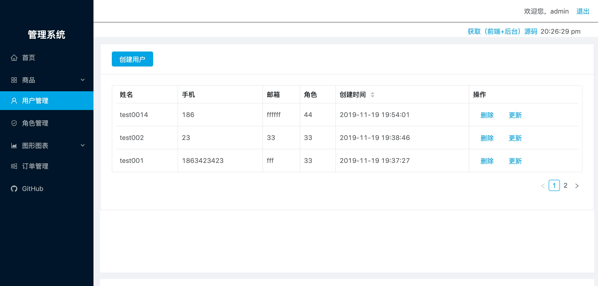
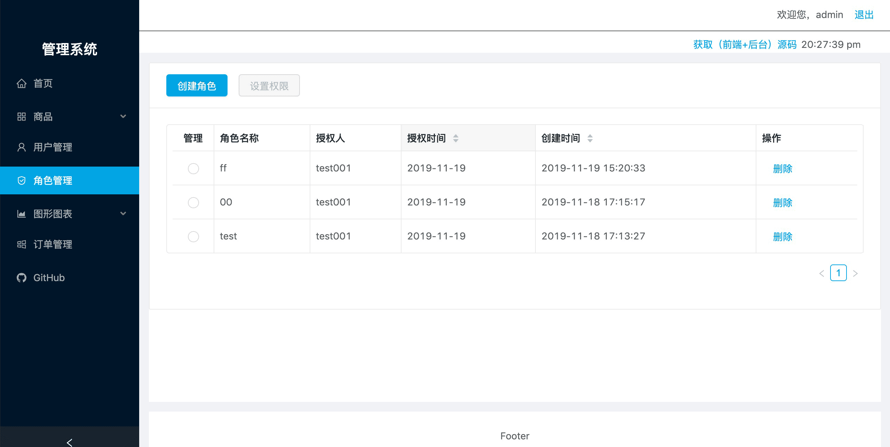
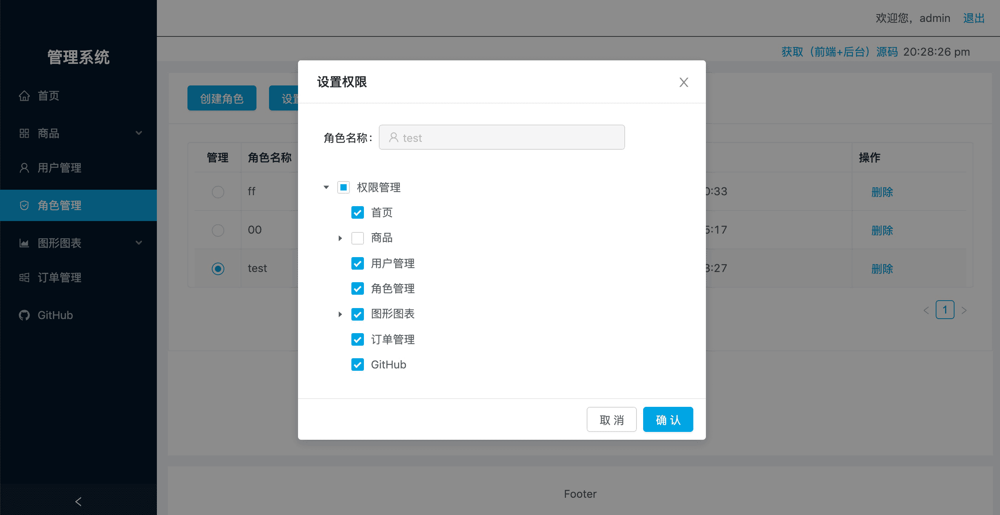

## 技术栈
>项目运行之前，请确保系统已经安装以下应用
1. node (6.0 及以上版本)
2. mongodb (开启状态) [安装参考](https://blog.csdn.net/composurext/article/details/79543271)
3. 全局安装nodemon(为了node服务热启动)
  ```
  yarn global add nodemon
  ```
4. [可以参考这里安装](https://blog.csdn.net/composurext/article/details/79543271)
## 运行启动
```
# 克隆到本地
1. git clone 

# 进入后台应用目录
2. cd react-manage/server

# 安装后台应用依赖
3. yarn install 

# 启动后台应用
4. yarn start  

# 进人前端应用目录
5. cd react-manage/client

# 安装前端应用依赖
6. yarn install

# 启动前端应用
7. yarn start

# 启动浏览器
8. 访问: http://localhost:3000
```
## 应用基本结构
### client/src
|文件目录 |含义 |
| ----- | ------  |
| api | ajax相关  |
| assets | 公用资源  |
| components | 公共组件（非路由组件）  |
| pages | 路由组件  |
| config | 配置文件  |
| utils  |工具模块  |
| App.js | 应用根模块  |
| index.js| 应用入口  |
### server/src
|文件目录 |含义 |
| ----- | ------  |
| config | 配置参数  |
| db | 数据库连接  |
| logs | 日志文件  |
| modals | 数据库表结构  |
| public | 可以放前端静态资源  |
| router  | 路由  |
| server.js| 应用入口  |


## 功能
+ 首页
  + 登陆
    + node实现基于token的身份验证
  + 登出
  + 保持登录
    + 页面刷新时的store状态存储
+ 商品
  + 品类管理
    + 添加
    + 修改分类
    + 子分类
  + 商品管理
    + 搜索商品
    + 添加商品
    + 上架/下架
    + 修改/详情
  + 用户管理
    + 添加/删除
  + 角色管理
    + 权限控制
  + 订单管理
    + 进、入
  + 数据可视化
    + 柱形、折线、饼图等
  + GitHub
    + 其它项目展示


### 登录

### 品类管理

### 商品管理


### 用户管理

### 角色管理

### 权限控制
